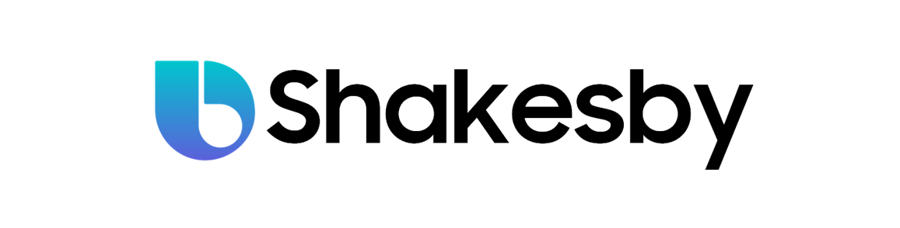
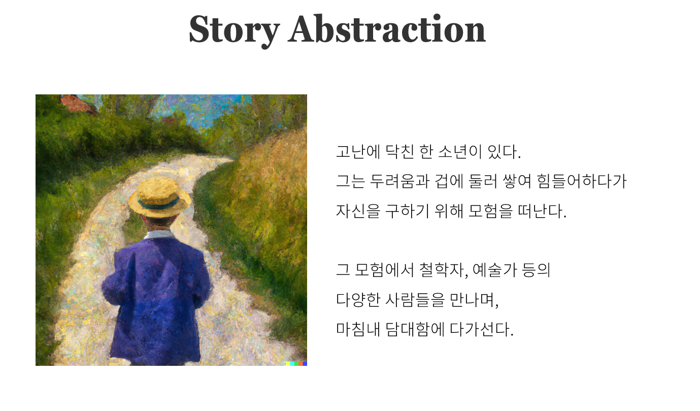
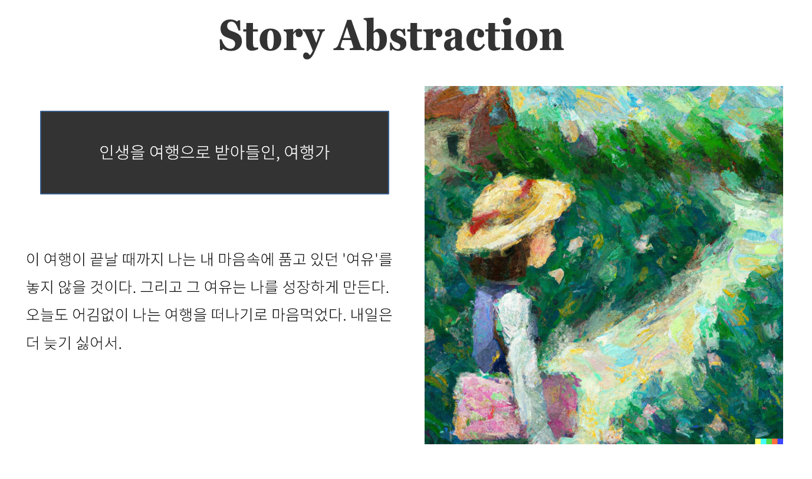
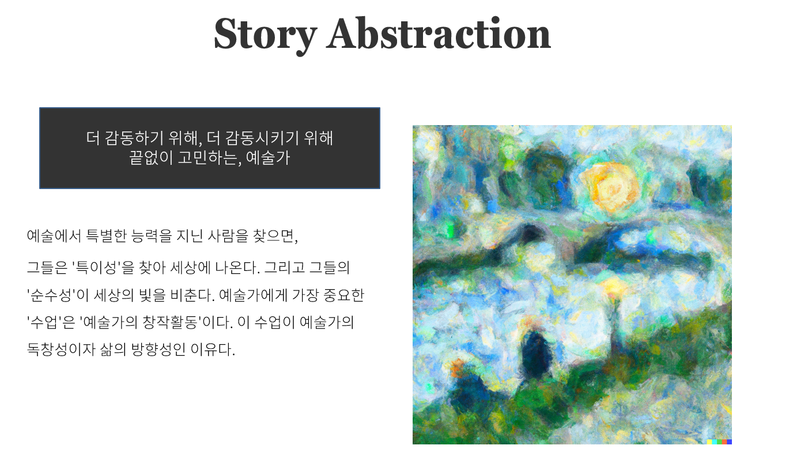
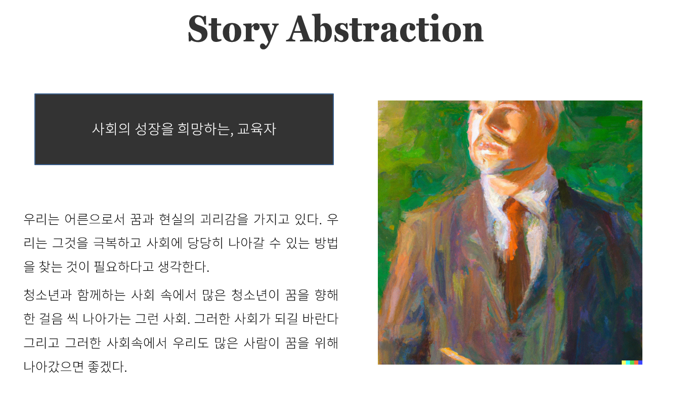
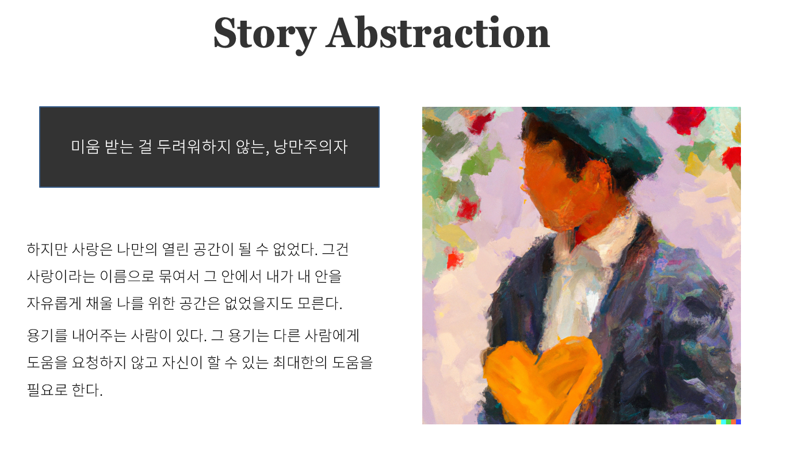
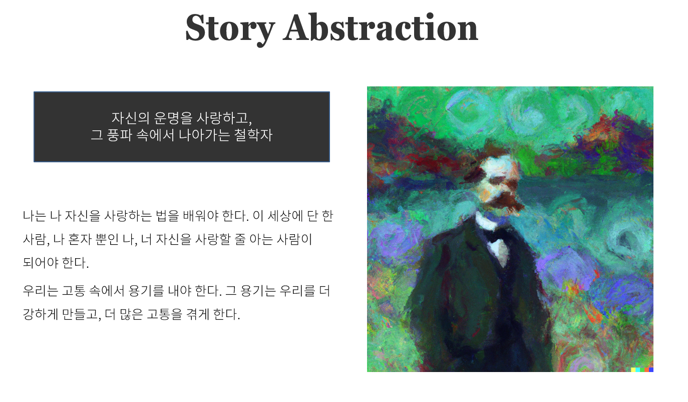
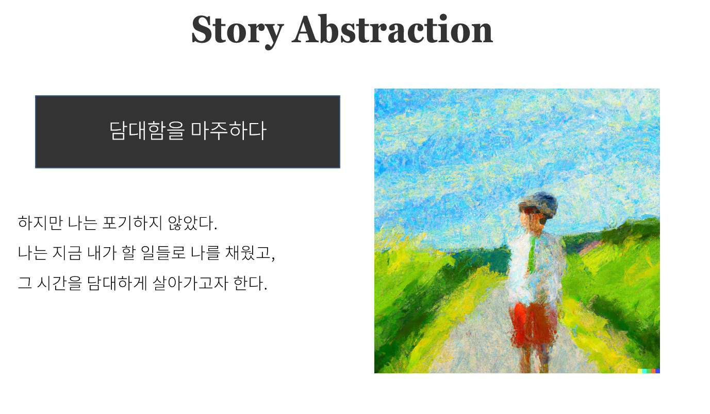

## 4th_bookathon 📚

 

### 북커톤에 참가한 'Hey, Shakesby(헤이, 셰익스비)' 팀입니다.

 

 

## Story 🌈

 

## Title: 동행 
- (대회 주제: 담대한)

 

 

더 자세한 이야기 펼치기

 

### ㄱ. 인생을 여행으로 받아들인 여행가

 

 

### ㄴ. 감동을 위해 끝없이 고민하는 예술가

 

 

### ㄷ. 사회의 성장을 희망하는 교육자

 

 

### ㄹ. 미움받는 걸 두려워하지 않는 낭만주의자

 

 

### ㅁ. 미움받는 걸 두려워하지 않는 낭만주의자

 

 

### 결말: 자신만의 담대함을 깨달은 소년

 

 

## Review 📝

자세한 [후기](https://heygeronimo.tistory.com/42)는 여기서 보실 수 있습니다.

 

## Requirements 🔑

~~~
pip install numpy pandas torch
pip install kss
pip install selenium
pip install transformers datasets
pip install wandb (optional)
~~~

- [kss](https://github.com/hyunwoongko/kss)
- [huggingface🤗](https://github.com/huggingface/transformers)
- [wandb](https://github.com/wandb/wandb)